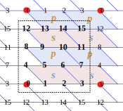

## Software requirements

The program requires the following scientific libraries:

- NumPy
- SciPy
- Matplotlib

To simplify installation and ensure a consistent environment we use **Conda**.

## Creating the course Python environment

After cloning this repository, create the environment:

```

conda env create -f environment.yml

```

Activate it with

```

conda activate KitaevDensityMatrix

```

After the environment setting is done, we can test the functions of the module ``SpinModelDM.py`` in the JupyterNotebook ``KitaevDM.ipynb``.

---

# Short Intro

## Lattice Geometry of the Finite-Size System

In this program, we consider a Kitaev model with a periodic boundary condition. The topological sector the ground state lies in is the one with the expectation value of both Wilson loops being 1. The lattice geometry is illustrated below, in which the honeycomb lattice has been reshaped to an equivalent brick-wall geometry. The red dots mark the identical lattice sites under such a periodic boundary condition.



## Minimal Size for Non-trivial Topology
For numerical efficiency, we tend to choose the smallest possible system. However, the system must still be sufficiently large such that the topological order still exists. A requirement for this is that the ground state manifold should possess four independent topological sectors generated by global Wilson loops if the geometry of the system is a torus.

We start from the Wen plaquette model. There are two requirements for a Wen plaquette system to possess four topologically degenerate ground states:

* The lattice must contain an even number of rows or columns in both the horizontal and vertical directions.
    
* A global Wilson loop cannot be generated or destroyed by local plaquette operators.

The physical meaning of the first requirement is to preserve the checkerboard pattern of the lattice. If there are adjacent plaquettes (cells) that are of the same type (black or white, in a checkerboard sense), then the two types of plaquettes become identical, and the original two different Wilson loops become the same. This breakdown of the checkerboard pattern reduces the original fourfold topological ground state degeneracy down to twofold, which is not adequate to describe the physics of a toric code system.

According to the two requirements, \textbf{the smallest possible topologically non-trivial Wen plaquette model contains eight ($8 = 2\times 4$) distinct plaquettes and eight sites}. A $2\times 2$ checkerboard is not adequate for the system to have four topological sectors since it violates the second requirement\footnote{The \textit{global Wilson loop} is identical to a plaquette operator}. 

